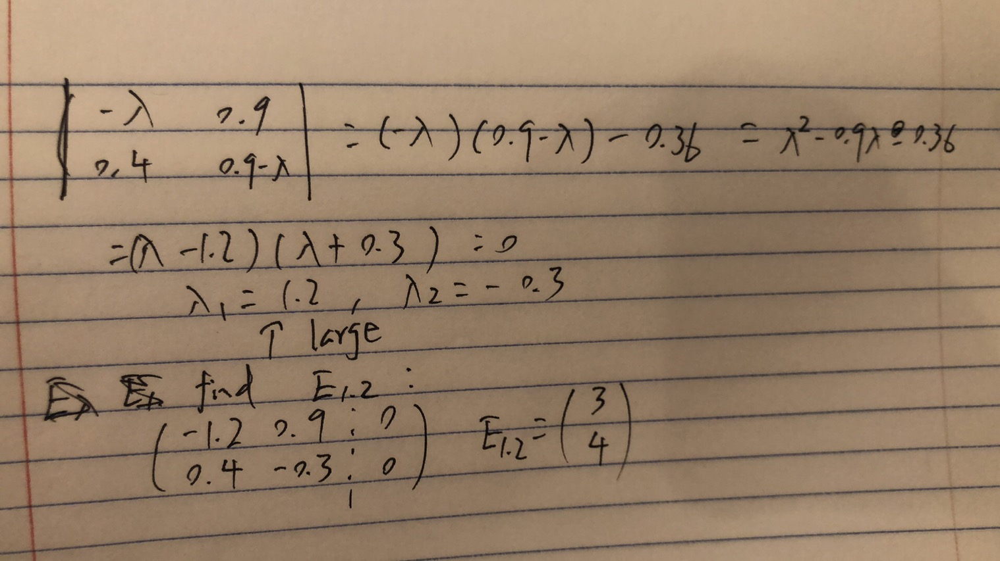

```{r setup, include=FALSE}
knitr::opts_chunk$set(echo = TRUE)
```

## Problem 1

### a
Start from growth rate: $$R(t) = \frac{N(t+\Delta t - N(t))}{\Delta t N(t)}$$ if we measure the population instaneously, 
$$R(t) = \lim_{\Delta t\to0} \frac{N(t+\Delta t - N(t))}{\Delta t N(t)} = \frac{1}{N(t)}\lim_{\Delta t\to0} \frac{N(t+\Delta t - N(t))}{\Delta t} = \frac{1}{N} \frac{dN}{dt}$$
For a constant growth rate, $$\frac{dN}{dt} = R_0N$$

### b Solve ODE
$$\frac{dN}{dt} = R_0N$$
$$\frac{dN}{N} = R_0dt$$
$$log(N) = R_0t+C_1$$
$$N = C_2e^{R_0t}$$
Plug in initial condition we get:
$$N(t) = 1000e^{0.03t}$$

### c
```{r}
xcon <- seq(0, 100, len=10000)
ycon <- 1000 * exp(0.03*xcon)
xdis <- seq(0, 100)
ydis <- 1000*1.03^(xdis)
plot(xcon, ycon,type="l",col=1)
points(xdis,ydis,col=2,cex=0.5)
```

I realize the discrete is closer to contineous one than I thought, yet the distance is getting larger, And discrete is growing slower.

## problem 2

### (a)
```{r}
L <- rbind(c(1,1),c(1/2,3/2))
eig <- eigen(L)
eigv <- eig[[1]]
eigV <- eig[[2]] / rep(apply(eig[[2]], 2, min),each=2) #simplify eigenvactor
eigv
eigV
```
The population will grow without bound, since largest eigenvalue is `` `r eigen(L)[[c(1,1)]]` `` greater than 1.

### (b) Calculat $N_k$ by hand and compare with computer stimulation

Solve $\begin{pmatrix}1&1\\1/2 & 3/2 \end{pmatrix} \begin{pmatrix}X_1\\X_2 \end{pmatrix} = \begin{pmatrix}1\\4 \end{pmatrix}$, we get $\begin{pmatrix}X_1\\X_2 \end{pmatrix} = \begin{pmatrix}3\\ -2 \end{pmatrix}$
So we have $N_0 = 3 \begin{pmatrix}1\\1 \end{pmatrix} - 2 \begin{pmatrix}1\\-0.5 \end{pmatrix}$, The we have $N_k$ from recurrence relation, 
$N_k = L^kN_0 = L^k (3 \begin{pmatrix}1\\1 \end{pmatrix} - 2 \begin{pmatrix}1\\-0.5 \end{pmatrix}) = 3L^k \begin{pmatrix}1\\1 \end{pmatrix} - 2L^k \begin{pmatrix}1\\-0.5 \end{pmatrix} = 3  \times 2^k\begin{pmatrix}1\\1 \end{pmatrix} - 2 \times 0.5^k \begin{pmatrix}1\\-0.5 \end{pmatrix}$.  
When k = 4, $N_4 = 3  \times 2^4\begin{pmatrix}1\\1 \end{pmatrix} - 2 \times 0.5^4 \begin{pmatrix}1\\-0.5 \end{pmatrix} = \begin{pmatrix}47.875\\48.0625 \end{pmatrix}$
```{r}
# running with computer
L %*% L %*% L %*% L %*%  matrix(c(1, 4))
```
Which gives exact the same answer.

### (c)
as $k\to \inf$, only term with largest eigenvalue exist, so stable population is $\vec{N} = \begin{pmatrix}1/2\\1/2 \end{pmatrix}$

## Problem 3

### (a) Write down a Leslie matrix model
$$\begin{pmatrix}N_j^{k+1}\\N_a^{k+1} \end{pmatrix} = \begin{pmatrix}0 & b \\ s &1-m  \end{pmatrix} \begin{pmatrix}N_j^{k}\\N_a^{k} \end{pmatrix}$$

### (b) find long term polulation

{width=350px}
So. long term growth factor is 1.2.  
as $k\to \inf$, only term with largest eigenvalue exist, so stable population is $\vec{N} = \begin{pmatrix}3/7\\4/7 \end{pmatrix}$
```{r}
L <- rbind(c(0,0.9),c(0.4,0.9))
eig <- eigen(L)
eigv <- eig[[1]]
eigV <- eig[[2]] / c(-0.2, -0.2, eig[[2]][4], eig[[2]][4])
eigv
eigV
```

## Problem 4

### (a) explain Leslie matrix
* For $N_{k+1}^{(F)}$ :
    * There are $(1-m)N_{k}^{(F)}$ F survived, and t of survived transformed So there are $(1-m)(1-t)N_{k}^{(F)}$ left as F.
    * There are $(1-m)N_{k}^{(T)}$ T survived and u of them transform to F. So there are $(1-m)uN_{k}^{(F)}$ transform form T to F.
    * No $N_{k}^{(J)}$ become F in day k+1.
* For $N_{k+1}^{(J)}$ :
    * No F in day k become J in day k+1.
    * There are $(1-m)N_{k}^{(J)}$ J survived, and c of survived transformed So there are $(1-m)(1-c)N_{k}^{(J)}$ left as J.
    * There are $(1-m)N_{k}^{(T)}$ T survived and each of them produce b J. So there are $(1-m)bN_{k}^{(T)}$ J are produced by T.
* For $N_{k+1}^{(J)}$ :
    * There are $(1-m)N_{k}^{(F)}$ F survived, and t of survived transformed to T. So there are $(1-m)tN_{k}^{(F)}$ transform from F to T.
    * There are $(1-m)N_{k}^{(J)}$ J survived, and c of survived transformed to T. So there are $(1-m)cN_{k}^{(J)}$ transform form J to T.
    * There are $(1-m)N_{k}^{(T)}$ T survived, and u of survived transformed. So there are $(1-m)(1-u)N_{k}^{(J)}$ left as T.
    
### (b) explore Leslie matrix

#### (i) find eigenvalue
```{r}
L <- rbind(c(0.6,0,0.7),c(0,0.4,0.5),c(0.3,0.5,0.2))
eig <- eigen(L)
stableV <- eig[[2]][,1] / sum(eig[[2]][,1])
names(stableV) <- c("F", "J", "T")
eig
```
So largest eigenvalue is `` `r eig[[c(1,1)]]` ``,  larger than 1, so the population will grow without bound.

Here is the stable fraction:
```{r}
stableV
```

#### (ii)
```{r}
N0 <- c(0, 100, 0)
population_at_k_day <- function(k) {
  result <- N0
  for (i in seq(k)) {
    result <- L %*% result
  }
  return(result)
}
population_array <- vapply(1:10, population_at_k_day, FUN.VALUE = numeric(3))
rownames(population_array) <- c("F", "J", "T")
population_array <- cbind(N0, population_array)
colnames(population_array) <- 0:10
```

\newpage

##### The table for population from day 0 to day 10
```{r}
population_array
```

##### Growth factor matrix
```{r}
growth_factor_matrix <- population_array[,9:11] / population_array[,8:10]
colnames(growth_factor_matrix) <- c("7 to 8", "8 to 9", "9 to 10")
rownames(growth_factor_matrix) <- c("F", "J", "T")
growth_factor_matrix
```

##### Fraction cell
```{r}
fraction_matrix <- population_array[,9:11] / rep(apply(population_array[,9:11],2,sum),each=3)
colnames(fraction_matrix) <- 8:10
rownames(fraction_matrix) <- c("F", "J", "T")
fraction_matrix
```
As we can see, the fraction of cells are converging to the theoretic value we calculated in part i.